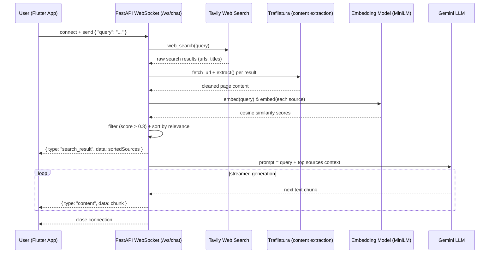
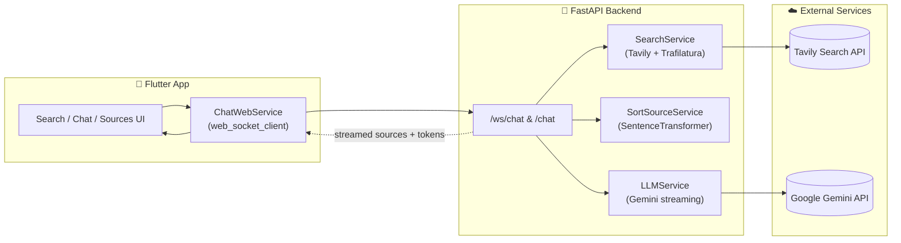

# 🔎 Perplexity Recreation

An open-source, from-scratch recreation of **Perplexity AI** — a real-time, citation-backed answer engine that searches the live web, ranks the results with AI, and streams a grounded answer back to the user token-by-token.

The project is a full-stack app: a **Flutter** client on the frontend and an **AI-powered FastAPI backend** that does the real work — web search, semantic re-ranking, and LLM-generated, source-cited responses streamed over a WebSocket.

> ⚠️ This is a learning/portfolio project recreating Perplexity's core UX, not affiliated with Perplexity AI.

---

## ✨ What makes this project interesting

This isn't just a chatbot wrapper — it's a small **retrieval-augmented generation (RAG) pipeline** built from scratch:

| Stage | What happens | Powered by |
|---|---|---|
| 🌐 **Web Search** | The user's query is sent out to the live web to fetch fresh, real-world results — not just the model's training data | [Tavily Search API](https://tavily.com/) + [Trafilatura](https://trafilatura.readthedocs.io/) for clean content extraction |
| 🧠 **AI Re-ranking** | Every result is embedded into vector space alongside the query, and only the semantically relevant sources survive | `sentence-transformers` (`all-MiniLM-L6-v2`) + cosine similarity |
| ✍️ **AI Answer Generation** | The top-ranked sources are stuffed into a grounded prompt and the LLM streams back a cited, context-aware answer | Google **Gemini** (`generate_content_stream`) |
| ⚡ **Realtime Delivery** | Sources arrive first, then the answer streams in chunk-by-chunk, exactly like Perplexity's UI | **FastAPI WebSockets** |

In short: **Search → Rank → Reason → Stream** — a compact, readable implementation of the pattern powering modern AI answer engines.

---

## 🧭 Flow Diagram



**The pipeline in plain English:**
1. The Flutter app opens a WebSocket to the backend and sends the user's query.
2. The backend calls **Tavily** to search the live web for that query.
3. Each result URL is fetched and cleaned with **Trafilatura**, stripping ads/boilerplate down to real article text.
4. Every source is embedded and compared to the query embedding via **cosine similarity** — low-relevance sources (score ≤ 0.3) are dropped.
5. The sorted, relevant sources are sent to the client immediately, so citations show up before the answer does.
6. The surviving sources are packed into a single grounded prompt and sent to **Gemini**, which streams its answer back.
7. Each streamed chunk is forwarded to the client in real time, so the answer appears progressively — just like Perplexity.

---

## 🏗️ Architecture



---

## 📁 Project Structure

```
perplixity_recreation/
├── backend/                      # 🐍 FastAPI + AI backend
│   ├── main.py                   # WebSocket (/ws/chat) & REST (/chat) endpoints
│   ├── config.py                 # Loads TAVILY_API_KEY / GEMINI_API_KEY from .env
│   ├── pydantic_models/
│   │   └── chat_body.py          # Request schema for the REST endpoint
│   └── services/
│       ├── search_service.py     # Web search + content extraction (Tavily, Trafilatura)
│       ├── sort_source_service.py# Embedding-based relevance ranking (sentence-transformers)
│       └── llm_service.py        # Prompt construction + streaming generation (Gemini)
│
├── lib/                          # 📱 Flutter frontend
│   ├── main.dart
│   ├── pages/                    # home_page, chat_page
│   ├── services/                 # chat_web_service.dart (WebSocket client)
│   ├── theme/                    # colours.dart
│   └── wigets/                   # search bar, answer section, sources section, sidebar
│
├── android/ ios/ linux/ macos/ web/ windows/   # Flutter platform targets
└── pubspec.yaml                  # Flutter dependencies
```

---

## 🛠️ Tech Stack

**Backend (the AI engine)**
- **FastAPI** — async Python web framework serving both a WebSocket endpoint (streaming chat) and a REST endpoint
- **Tavily API** — real-time web search
- **Trafilatura** — extracts clean article text from raw HTML
- **sentence-transformers** (`all-MiniLM-L6-v2`) — embeds text for semantic relevance ranking
- **Google Gemini** (`google-genai`) — generates the grounded, cited final answer, streamed token-by-token
- **Pydantic / pydantic-settings** — request validation & environment config
- **Uvicorn** — ASGI server

**Frontend**
- **Flutter** (cross-platform: Android, iOS, Web, Windows, macOS, Linux)
- `web_socket_client` — consumes the backend's streamed WebSocket events

---

## 🚀 Getting Started

### Prerequisites
- **Python 3.10+**
- **Flutter SDK** (`^3.12.2` per `pubspec.yaml`)
- API keys for:
  - [Tavily](https://app.tavily.com/) → `TAVILY_API_KEY`
  - [Google AI Studio](https://aistudio.google.com/apikey) → `GEMINI_API_KEY`

### 1. Clone the repo
```bash
git clone https://github.com/Kartikiscalm/perplixity_recreation.git
cd perplixity_recreation
```

### 2. Set up the backend

```bash
cd backend
python -m venv venv
source venv/bin/activate      # On Windows: venv\Scripts\activate

pip install fastapi "uvicorn[standard]" python-dotenv pydantic-settings \
            tavily-python trafilatura sentence-transformers numpy google-genai
```

Create a `.env` file inside `backend/`:
```env
TAVILY_API_KEY=your_tavily_api_key_here
GEMINI_API_KEY=your_gemini_api_key_here
```

Run the server:
```bash
python main.py
```
The API will be live at `http://localhost:8000`, with:
- `POST /chat` — send `{ "query": "..." }`, get a full text response back
- `WS /ws/chat` — connect and send `{ "query": "..." }` to receive streamed `search_result` and `content` events

### 3. Set up the Flutter frontend

```bash
cd ..              # back to project root
flutter pub get
flutter run        # choose a device/emulator, or `flutter run -d chrome` for web
```

The app connects to the backend over `ws://localhost:8000/ws/chat` — if you're running the backend on a different host (e.g. a physical device or emulator), update the URL in `lib/services/chat_web_service.dart` accordingly (Android emulators typically use `ws://10.0.2.2:8000/ws/chat`).

### 4. Try it out
Type a question into the app — you'll see the ranked sources appear first, followed by the AI-generated answer streaming in live.

---

## 🗺️ Roadmap ideas
- [ ] Inline citation markers linking answer text to specific sources
- [ ] Conversation history / follow-up questions
- [ ] Swap in a `requirements.txt` / `pyproject.toml` for reproducible installs
- [ ] Dockerize the backend
- [ ] Add response caching to cut down on repeated search + embedding costs

---

## 🤝 Contributing
Issues and PRs are welcome — this is an actively evolving learning project. Feel free to fork it and experiment with different search providers, embedding models, or LLMs.

## 📄 License
No license specified yet — reach out to the repo owner before reusing this commercially.